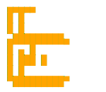

<p align="center">
  
</p>

<p align="center">
  
  &nbsp;&nbsp;
  <b>×</b>
  &nbsp;&nbsp;
  
  &nbsp;&nbsp;
  <b>×</b>
  &nbsp;&nbsp;
  
</p>

<div align="center">

[](https://linkedin.com/in/YOUR_LINKEDIN)
[](https://github.com/dgexplores)
[](https://leetcode.com/dgexplores)
[](mailto:YOUR_EMAIL)


</div>

<p align="center">
  
</p>

## 💫 About Me

```yaml
Role:
  - Software Engineer
  - AI Engineer

Currently Building:
  - Network Intrusion Detection System
  - Intelligent Observability Platform

Learning:
  - Machine Learning
  - Autonomous Agents
  - Cloud Computing & Kubernetes
  - System Design

2026 Goals:
  - Crack FAANG
  - Contribute to Open Source
  - Build AI Products
```

---

## 💻 Tech Stack

### Languages


### Frontend


### Backend & DevOps


### Databases


### AI & Security


**Security Tools:** Suricata, Zeek, Elasticsearch, Kibana, Wireshark

---

## 🚀 Featured Projects

### 🛡️ AI Network Intrusion Detection System
A real-time intrusion detection platform built using the Elastic Stack and open-source security tools.

**Tech:** Docker, Suricata, Zeek, Elasticsearch, Kibana, Filebeat
**Status:** 85% Complete

**Features:**
- Real-time intrusion detection
- Live Kibana dashboards
- Network traffic monitoring
- Attack visualization
- Centralized log analysis

**Repository:** Coming Soon | **Demo:** Coming Soon

---

### 🤖 Intelligent Observability Platform
An AI-powered platform for monitoring applications, analyzing logs, and detecting anomalies.

**Tech:** Python, Docker, Elasticsearch, Kibana, Machine Learning, FastAPI
**Status:** 65% Complete

**Features:**
- AI anomaly detection
- Intelligent log analysis
- Root cause analysis
- Interactive dashboards
- Cloud-native architecture

**Repository:** Coming Soon | **Demo:** Coming Soon

---

### 🌾 Farmer Marketplace
A full-stack platform connecting farmers directly with buyers.

**Tech:** React, Firebase, Google Maps, Authentication
**Features:**
- Secure Authentication
- Real-time Chat
- Product Listings
- Order Management

**Repository:** Coming Soon | **Demo:** Coming Soon

---

## 🐍 Open Source Activity

<div align="center">


</div>

---

## 🤝 Let's Connect

<div align="center">

[](https://linkedin.com/in/YOUR_LINKEDIN)
[](https://github.com/dgexplores)
[](https://leetcode.com/dgexplores)
[](mailto:YOUR_EMAIL)

</div>

---

**"Code. Learn. Build. Repeat."**
